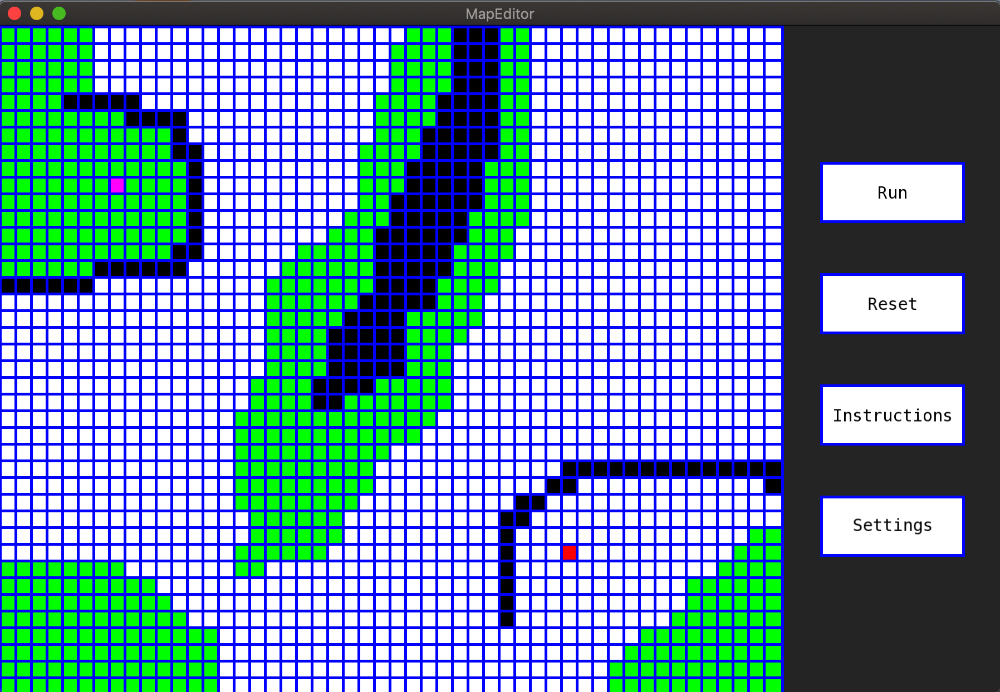
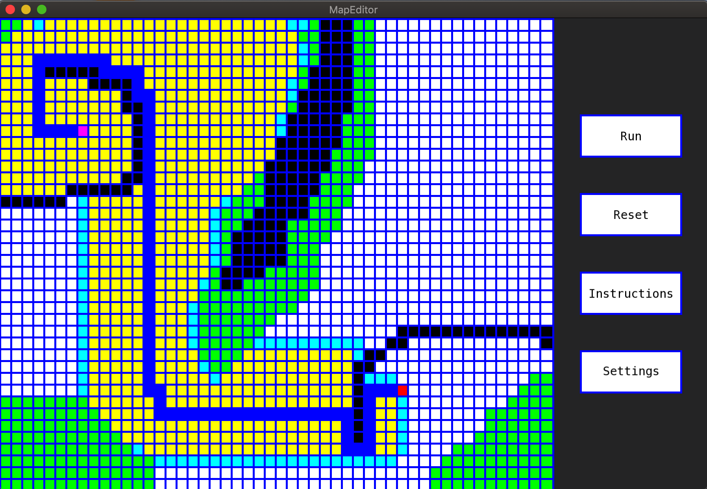

# Astar
This is my simple implementation of an <strong>A* pathfinding visualization</strong> program.

That's it: set start an goal node on map, press Run, and the program will find and show you 
the most suitable path among the two nodes.

Press Instruction for a detailed guide on how use the program.

Here some screenshot:

<em>Initial map configuration</em>

<em>After run A star</em>
  

